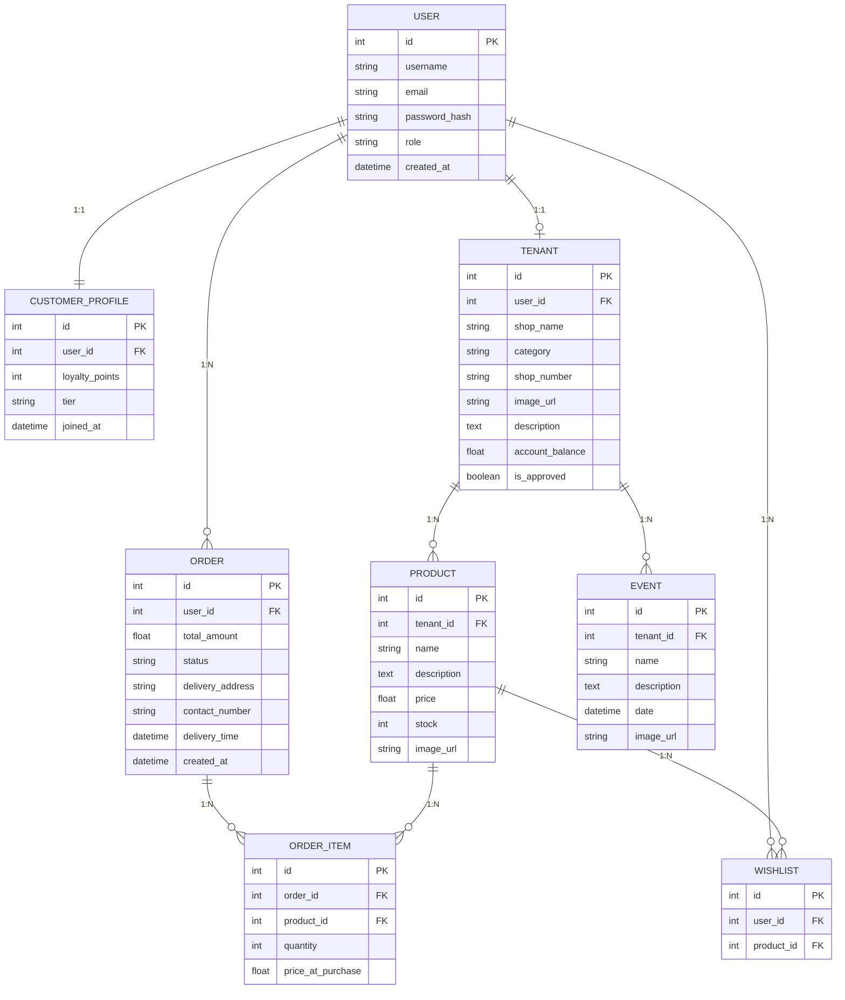

# Database Schema Documentation: Queens Club

This document provides a detailed breakdown of the "Queens Club" relational database architecture.

---

## 1. Relationship Visualizer (ERD)

The diagram below shows how tables connect through **Primary Keys (PK)** and **Foreign Keys (FK)**.

- `||--||` = **1:1** Relationship (One-to-One)
- `||--o{` = **1:N** Relationship (One-to-Many)

---

## 2. Table Structures & Definitions

### **Table: `user`**
Stores core authentication and profile management data.

| Column | Type | Key | Notes |
| :--- | :--- | :--- | :--- |
| `id` | Integer | **PK** | Unique identifier for each user |
| `username` | String | | Unique login name |
| `email` | String | | Unique contact email |
| `password_hash` | String | | Encrypted security password |
| `role` | String | | `admin`, `tenant`, or `customer` |
| `created_at` | DateTime | | Auto-generated timestamp |

---

### **Table: `tenant`**
Stores boutique and shop-specific metadata.

| Column | Type | Key | Notes |
| :--- | :--- | :--- | :--- |
| `id` | Integer | **PK** | |
| `user_id` | Integer | **FK** | Links to `user.id` (1:1 Relationship) |
| `shop_name` | String | | |
| `category` | String | | `Fashion`, `Electronics`, etc. |
| `shop_number` | String | | Physical location ID |
| `account_balance` | Float | | Accumulated revenue |
| `is_approved` | Boolean | | Admin approval status |

---

### **Table: `product`**
Stores the inventory items for each boutique.

| Column | Type | Key | Notes |
| :--- | :--- | :--- | :--- |
| `id` | Integer | **PK** | |
| `tenant_id` | Integer | **FK** | Links to `tenant.id` (1:N Relationship) |
| `name` | String | | |
| `description` | Text | | |
| `price` | Float | | |
| `stock` | Integer | | Quantity available |

---

### **Table: `order`**
Tracks transactions and delivery status.

| Column | Type | Key | Notes |
| :--- | :--- | :--- | :--- |
| `id` | Integer | **PK** | |
| `user_id` | Integer | **FK** | Customer who placed order (`user.id`) |
| `total_amount` | Float | | |
| `status` | String | | `Pending`, `Completed`, `Cancelled` |
| `delivery_address`| String | | |
| `created_at` | DateTime | | Transaction timestamp |

---

### **Table: `order_item`**
Junction table mapping products to specific orders.

| Column | Type | Key | Notes |
| :--- | :--- | :--- | :--- |
| `id` | Integer | **PK** | |
| `order_id` | Integer | **FK** | Links to `order.id` |
| `product_id` | Integer | **FK** | Links to `product.id` |
| `quantity` | Integer | | |
| `price_at_purchase`| Float | | Price snapshot at time of order |

---

### **Table: `customer_profile`**
Loyalty-specific data for customers.

| Column | Type | Key | Notes |
| :--- | :--- | :--- | :--- |
| `id` | Integer | **PK** | |
| `user_id` | Integer | **FK** | Links to `user.id` (1:1 Relationship) |
| `loyalty_points`| Integer | | |
| `tier` | String | | `Bronze`, `Silver`, `Gold`, `Platinum` |

---

### **Table: `wishlist`**
Saves items for later purchase.

| Column | Type | Key | Notes |
| :--- | :--- | :--- | :--- |
| `id` | Integer | **PK** | |
| `user_id` | Integer | **FK** | Links to `user.id` |
| `product_id` | Integer | **FK** | Links to `product.id` |
